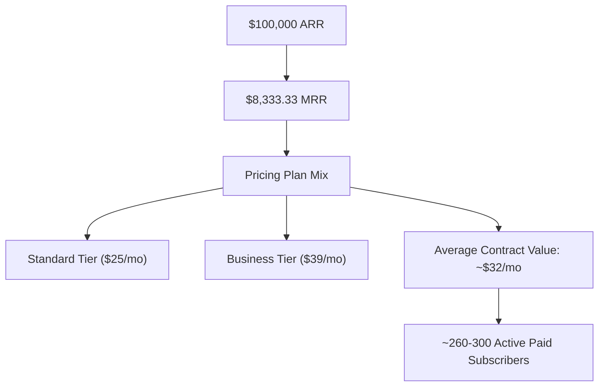

# DocTransfer: Programmatic SEO Growth Plan to $100k ARR

This document outlines the strategic growth roadmap to scale **DocTransfer** to **$100,000 ARR** (Annual Recurring Revenue) using Programmatic SEO (pSEO).

---

## 📊 1. The $100k ARR Growth Math

To reach $100,000 ARR, DocTransfer needs to achieve **$8,333.33 MRR** (Monthly Recurring Revenue). 



### Funnel & Traffic Requirements

Assuming B2B SaaS conversion benchmarks optimized for high-intent programmatic search traffic:

| Funnel Stage | Conversion Rate | Count (Monthly) | Notes |
| :--- | :--- | :--- | :--- |
| **Organic Traffic** | - | **80,000 - 100,000** | High-intent search visitors |
| **Free Signups** | 4.0% | **3,200 - 4,000** | Interactive template use / Link shares |
| **Paid Conversions** | 8.0% | **256 - 320** | Upgrade triggered by usage/feature limits |
| **Total Paid Users** | **0.32% (Overall)** | **~300 Users** | Hitting the $100k ARR target |

### Page-Level Performance Requirements
To capture 90,000 visits per month across different database scales:
*   **With 600 pages (Current)**: Each page must average **150 visits/month** (5 visits/day).
*   **With 2,000 pages (Target)**: Each page needs only **45 visits/month** (1.5 visits/day).

---

## 🛠️ 2. The 3-Phase Execution Roadmap

```
Phase 1: Foundation (Months 1-2)    🚀 Fix technical SEO, index 600 current pages, add email lead gates.
Phase 2: Expansion (Months 3-6)     📈 Add DocSend alternative pages, expand to 2,000+ pages (Real Estate, VCs).
Phase 3: Optimization (Month 6+)    💰 PLG virality loops, comparison matrices, limit/paywall optimization.
```

### Phase 1: Technical Foundation & Lead Gating (Months 1 - 2)

Our immediate priority is to get the current **596 programmatic pages** indexed by Google and start capturing leads from the traffic.

1.  **Submit the Corrected Sitemap**:
    *   With the Vercel routing fix deployed, submit `sitemap.xml` directly to Google Search Console (GSC). Googlebot will now read the static pre-rendered HTML containing unique meta tags, semantic articles, and JSON-LD schema.
2.  **Verify Crawl Status**:
    *   Monitor the `/sitemap-directory` crawl hub in GSC to ensure all orphan warnings are cleared and Googlebot can successfully discover and index all programmatic pages.
3.  **Implement a Lead Gate on Template PDF Downloads**:
    *   **Current State**: Visitors can click "Download Sample" and get a generated PDF instantly without signing up.
    *   **The Growth Fix**: Modify the "Download Sample" behavior to require a free email address:
        *   User fills out fields -> Clicks "Get PDF Template" -> Enters email -> PDF downloads + Free account created.
        *   This feeds the user directly into a welcome onboarding email sequence, driving activation.

---

### Phase 2: High-Intent Keyword Expansion (Months 3 - 6)

To scale traffic, we must expand the programmatic database from 600 pages to **2,000+ pages** by targeting high-volume keywords and our closest competitor.

#### 1. Target "DocSend" Keywords (High-Value Search Intent)
DocTransfer's core value proposition is secure document sharing with page-by-page tracking and analytics. This matches **DocSend**, not just DocuSign. We will expand the vertical competitor lists:

| Category | Slug | Primary Target Keywords |
| :--- | :--- | :--- |
| **Alternatives** | `docsend-alternative-startups` | *free docsend alternative, pitch deck sharing free, deck tracking alternative* |
| **Comparisons** | `docsend-vs-doctransfer-fundraising` | *docsend vs doctransfer, docsend alternative pricing, secure deck sharing* |

#### 2. Expand Verticals & Niche Targets
Update `scripts/generate-500-pages.js` to include three new high-volume business verticals:

*   **Real Estate & Property Management**:
    *   *Keywords*: "free lease agreement template", "disclosure document transfer", "realtor e-signatures".
*   **Startup & VC Fundraising**:
    *   *Keywords*: "pitch deck tracking", "confidential VC data room", "safe note agreement template".
*   **Creative Agencies & Freelancers**:
    *   *Keywords*: "free SOW template word", "freelance design contract", "client portal for agencies".

#### 3. Rerun Programmatic Generator
Deploy the generator script to compile and output these new directories:
```powershell
node scripts/generate-500-pages.js
npm run build
```

---

### Phase 3: PLG Virality & Paywall Optimization (Month 6+)

To convert the organic traffic into paid customers, we must build product-led growth (PLG) loops and optimize our paywalls.

#### 1. The Recipient Viral Loop (Low-Cost CAC)
Every time a DocTransfer free user sends a document, the recipient opens it on the `/view/:shareLink` route. This is our highest-converting acquisition channel:
*   Add a subtle, premium-looking banner in the document viewer:
    *   *"Powered by DocTransfer. Share documents securely with page-level tracking for free. [Create Free Account]"*
*   When the recipient signs, direct them to a success screen offering them to create their own free data room.

```
[Sender] shares deck ──> [Recipient] opens page ──> [Viewer Banner] ──> [Recipient signs up]
```

#### 2. Strategic Paywall Triggers
Optimize the limitations on the Free plan to nudge high-volume users to upgrade:
*   **File Size Limits**: Keep free tier at 10MB. Growing businesses sharing high-res PDFs or blueprints will easily hit this and upgrade to Standard (50MB) or Business (500MB).
*   **Branding Paywall**: Display DocTransfer branding on all free share links. Offer custom branding (logo, colors, custom subdomain) exclusively on the Business Plan ($39/mo).
*   **Feature Lock**: Keep E2E encrypted vault modes, self-destruct timers, and advanced compliance logs locked under the Business Plan, targeting enterprise users.

---

## 📈 3. Tracking Growth KPIs

To ensure we are on track to $100k ARR, monitor the following metrics monthly:

1.  **Indexation Rate (GSC)**:
    *   *Target*: >90% of submitted URLs in `sitemap.xml` indexed.
2.  **Traffic (Google Analytics/Supabase Logs)**:
    *   *Target*: 15% month-over-month growth in unique organic search traffic.
3.  **MQLs (Marketing Qualified Leads)**:
    *   *Target*: Number of email accounts created via template downloads.
4.  **LTV to CAC Ratio**:
    *   *Target*: Since programmatic traffic is organic, CAC is virtually $0 (excluding hosting/tool costs), leading to a highly profitable LTV/CAC ratio.
